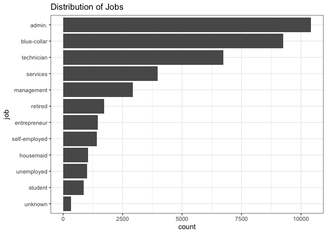
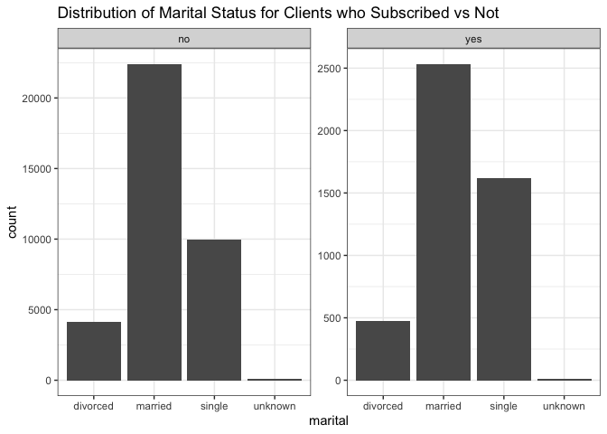
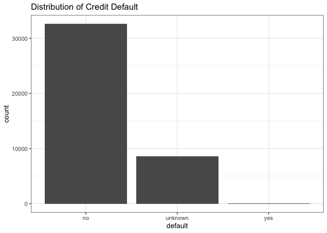
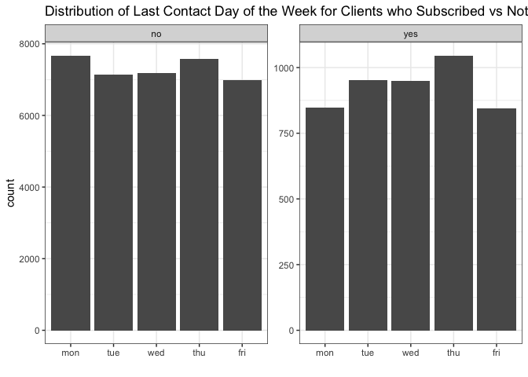
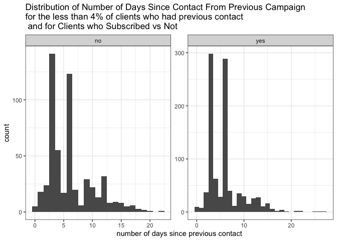
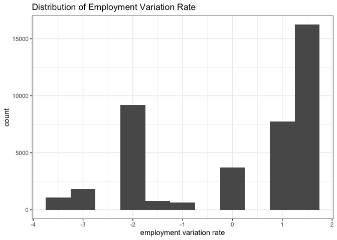
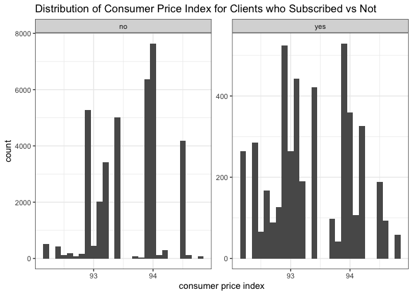
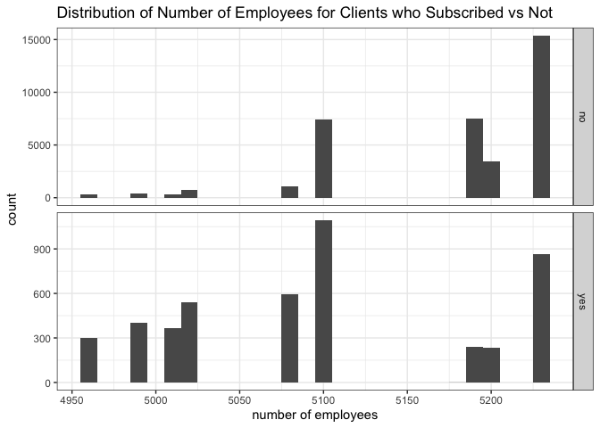

Rocket Case Study - EDA
================
Rachel K. Riggs<br>
March 21, 2021

``` r
suppressPackageStartupMessages(library(tidyverse))
suppressPackageStartupMessages(library(scales))
library(forcats)
library(pander)
library(ggcorrplot)
```

Data is from UC Irvine’s Machine Learning Repository and was dowloaded
from here: <https://archive.ics.uci.edu/ml/datasets/Bank+Marketing>

**Data Set Information:**

The data is related with direct marketing campaigns of a Portuguese
banking institution. The marketing campaigns were based on phone calls.
Often, more than one contact to the same client was required, in order
to access if the product (bank term deposit) would be (‘yes’) or not
(‘no’) subscribed.

There are four datasets:

1.  `bank-additional-full.csv` with all examples (41188) and 20 inputs,
    ordered by date (from May 2008 to November 2010), very close to the
    data analyzed in \[Moro et al., 2014\]
2.  `bank-additional.csv` with 10% of the examples (4119), randomly
    selected from 1), and 20 inputs.
3.  `bank-full.csv` with all examples and 17 inputs, ordered by date
    (older version of this dataset with less inputs).
4.  `bank.csv` with 10% of the examples and 17 inputs, randomly selected
    from 3 (older version of this dataset with less inputs).

The smallest datasets are provided to test more computationally
demanding machine learning algorithms (e.g., SVM).

The classification goal is to predict if the client will subscribe
(yes/no) a term deposit (variable y).

-----

``` r
# load data
bank_additional_full <- as_tibble(read.csv("data/bank-additional-full.csv", sep = ";"))
# bank_additional <- as_tibble(read.csv("data/bank-additional.csv", sep = ";"))
# bank_full <- as_tibble(read.csv("data/bank-full.csv", sep = ";"))
# bank <- as_tibble(read.csv("data/bank.csv", sep = ";"))
```

# Exploratory Data Analysis

  - Since the description of the data says that `bank.csv` and
    `bank-full.csv` are “older versions of this dataset with less
    inputs”, I will not use them. However, in a real world context and
    assuming I had more time, I would probably want to investigate them
    to make sure I’m not missing anything.
  - `bank-additional.csv` is a randomly sampled subset of
    `bank-additional-full.csv`, for testing slow algorithms.
  - So the dataset we want to explore is `bank-additional-full.csv`.

<!-- end list -->

``` r
bank_additional_full %>% 
  head() %>% knitr::kable()
```

| age | job       | marital | education   | default | housing | loan | contact   | month | day\_of\_week | duration | campaign | pdays | previous | poutcome    | emp.var.rate | cons.price.idx | cons.conf.idx | euribor3m | nr.employed | y  |
| --: | :-------- | :------ | :---------- | :------ | :------ | :--- | :-------- | :---- | :------------ | -------: | -------: | ----: | -------: | :---------- | -----------: | -------------: | ------------: | --------: | ----------: | :- |
|  56 | housemaid | married | basic.4y    | no      | no      | no   | telephone | may   | mon           |      261 |        1 |   999 |        0 | nonexistent |          1.1 |         93.994 |        \-36.4 |     4.857 |        5191 | no |
|  57 | services  | married | high.school | unknown | no      | no   | telephone | may   | mon           |      149 |        1 |   999 |        0 | nonexistent |          1.1 |         93.994 |        \-36.4 |     4.857 |        5191 | no |
|  37 | services  | married | high.school | no      | yes     | no   | telephone | may   | mon           |      226 |        1 |   999 |        0 | nonexistent |          1.1 |         93.994 |        \-36.4 |     4.857 |        5191 | no |
|  40 | admin.    | married | basic.6y    | no      | no      | no   | telephone | may   | mon           |      151 |        1 |   999 |        0 | nonexistent |          1.1 |         93.994 |        \-36.4 |     4.857 |        5191 | no |
|  56 | services  | married | high.school | no      | no      | yes  | telephone | may   | mon           |      307 |        1 |   999 |        0 | nonexistent |          1.1 |         93.994 |        \-36.4 |     4.857 |        5191 | no |
|  45 | services  | married | basic.9y    | unknown | no      | no   | telephone | may   | mon           |      198 |        1 |   999 |        0 | nonexistent |          1.1 |         93.994 |        \-36.4 |     4.857 |        5191 | no |

Column types of the features:

``` r
bank_additional_full %>% 
  select(-y) %>% 
  lapply(class) %>% 
  unlist() %>% 
  table() %>% 
  knitr::kable()
```

| .       | Freq |
| :------ | ---: |
| factor  |   10 |
| integer |    5 |
| numeric |    5 |

  - 10 categorical features and 10 numeric

Check for missing values & get some summary
stats

``` r
pander(summary(bank_additional_full))
```

|      age      |        job        |    marital     |         education         |
| :-----------: | :---------------: | :------------: | :-----------------------: |
|  Min. :17.00  |   admin. :10422   | divorced: 4612 | university.degree :12168  |
| 1st Qu.:32.00 | blue-collar: 9254 | married :24928 |    high.school : 9515     |
| Median :38.00 | technician : 6743 | single :11568  |      basic.9y : 6045      |
|  Mean :40.02  |  services : 3969  |  unknown : 80  | professional.course: 5243 |
| 3rd Qu.:47.00 | management : 2924 |       NA       |      basic.4y : 4176      |
|  Max. :98.00  |  retired : 1720   |       NA       |      basic.6y : 2292      |
|      NA       |  (Other) : 6156   |       NA       |      (Other) : 1749       |

Table continues
below

|    default    |   housing    |     loan     |     contact     |     month     |
| :-----------: | :----------: | :----------: | :-------------: | :-----------: |
|   no :32588   |  no :18622   |  no :33950   | cellular :26144 |  may :13769   |
| unknown: 8597 | unknown: 990 | unknown: 990 | telephone:15044 |  jul : 7174   |
|    yes : 3    |  yes :21576  |  yes : 6248  |       NA        |  aug : 6178   |
|      NA       |      NA      |      NA      |       NA        |  jun : 5318   |
|      NA       |      NA      |      NA      |       NA        |  nov : 4101   |
|      NA       |      NA      |      NA      |       NA        |  apr : 2632   |
|      NA       |      NA      |      NA      |       NA        | (Other): 2016 |

Table continues
below

| day\_of\_week |    duration    |    campaign    |     pdays     |   previous    |
| :-----------: | :------------: | :------------: | :-----------: | :-----------: |
|   fri:7827    |   Min. : 0.0   |  Min. : 1.000  |  Min. : 0.0   |  Min. :0.000  |
|   mon:8514    | 1st Qu.: 102.0 | 1st Qu.: 1.000 | 1st Qu.:999.0 | 1st Qu.:0.000 |
|   thu:8623    | Median : 180.0 | Median : 2.000 | Median :999.0 | Median :0.000 |
|   tue:8090    |  Mean : 258.3  |  Mean : 2.568  |  Mean :962.5  |  Mean :0.173  |
|   wed:8134    | 3rd Qu.: 319.0 | 3rd Qu.: 3.000 | 3rd Qu.:999.0 | 3rd Qu.:0.000 |
|      NA       |  Max. :4918.0  |  Max. :56.000  |  Max. :999.0  |  Max. :7.000  |
|      NA       |       NA       |       NA       |      NA       |      NA       |

Table continues
below

|     poutcome      |   emp.var.rate   | cons.price.idx | cons.conf.idx |
| :---------------: | :--------------: | :------------: | :-----------: |
|  failure : 4252   |  Min. :-3.40000  |  Min. :92.20   |  Min. :-50.8  |
| nonexistent:35563 | 1st Qu.:-1.80000 | 1st Qu.:93.08  | 1st Qu.:-42.7 |
|  success : 1373   | Median : 1.10000 | Median :93.75  | Median :-41.8 |
|        NA         |  Mean : 0.08189  |  Mean :93.58   |  Mean :-40.5  |
|        NA         | 3rd Qu.: 1.40000 | 3rd Qu.:93.99  | 3rd Qu.:-36.4 |
|        NA         |  Max. : 1.40000  |  Max. :94.77   |  Max. :-26.9  |
|        NA         |        NA        |       NA       |      NA       |

Table continues below

|   euribor3m   | nr.employed  |     y     |
| :-----------: | :----------: | :-------: |
|  Min. :0.634  |  Min. :4964  | no :36548 |
| 1st Qu.:1.344 | 1st Qu.:5099 | yes: 4640 |
| Median :4.857 | Median :5191 |    NA     |
|  Mean :3.621  |  Mean :5167  |    NA     |
| 3rd Qu.:4.961 | 3rd Qu.:5228 |    NA     |
|  Max. :5.045  |  Max. :5228  |    NA     |
|      NA       |      NA      |    NA     |

### observations:

  - There are no missing values in the dataset

Are there any duplicate rows?

``` r
bank_additional_full %>% nrow()
```

    ## [1] 41188

``` r
bank_additional_full %>% unique() %>%  nrow()
```

    ## [1] 41176

  - Yes, there are some duplicate rows. These should be dropped before
    modeling the data.

# target variable

`y`: has the client subscribed a term deposit?

``` r
bank_additional_full %>% 
  ggplot(aes(x = y)) +
  geom_bar() +
  labs(x = "subscribed",
       title = "Distribution of Target Variable") +
  theme_bw()
```

<!-- -->

``` r
bank_additional_full %>% 
  group_by(y) %>% 
  summarize(count = n()) %>% 
  mutate(percent = count/nrow(bank_additional_full)) %>% 
  knitr::kable()
```

| y   | count |   percent |
| :-- | ----: | --------: |
| no  | 36548 | 0.8873458 |
| yes |  4640 | 0.1126542 |

### observations:

  - The target variable is imbalanced. More clients did not suscribe to
    a term deposit. Only 11.3% of clients did subscribe to a term
    deposit.

# features

## bank client data:

`age`

``` r
bank_additional_full %>% 
  ggplot(aes(x = age)) +
  geom_histogram(binwidth = 3) +
  labs(title = "Distribution of Ages") +
  theme_bw()
```

<!-- -->

### observations:

  - Most of the clients appear to fall in the age range of about 25-60
    years old. There appear to be some outliers of older clients.

Was the average age different between those that subscribed and those
that did not?

``` r
bank_additional_full %>% 
  group_by(y) %>% 
  summarize(mean_age = mean(age),
            median_age = median(age)) %>% 
  knitr::kable()
```

| y   | mean\_age | median\_age |
| :-- | --------: | ----------: |
| no  |  39.91119 |          38 |
| yes |  40.91315 |          37 |

``` r
bank_additional_full %>% 
  ggplot(aes(x = age)) +
  geom_histogram(binwidth = 3) +
  facet_grid(vars(y), scales = "free") +
  labs(title = "Distribution of Ages for Clients who Subscribed vs Not") +
  theme_bw()
```

<!-- -->

``` r
# compare with a boxplot just for fun
bank_additional_full %>% 
  ggplot(aes(x = age)) +
  geom_boxplot() +
  facet_grid(vars(y), scales = "free") +
  labs(title = "Distribution of Ages for Clients who Subscribed vs Not") +
  theme_bw()
```

<!-- -->

  - No, both the mean and median ages are only 1 year apart, and the
    distributions are fairly similar.

`job`

``` r
bank_additional_full %>% 
  ggplot(aes(x = fct_rev(fct_infreq(job)))) +
  geom_bar() +
  labs(x = "job",
       title = "Distribution of Jobs") +
  coord_flip() +
  theme_bw()
```

<!-- -->

Were the occupations clients held different for subscribers vs
non-subscribers?

``` r
bank_additional_full %>% 
  group_by(y, job) %>% 
  summarize(job_count = n()) %>% 
  mutate(total_per_group = sum(job_count),
         percent = job_count/total_per_group) %>% 
  ggplot(aes(x = reorder(job, percent), y = percent)) +
  geom_bar(stat = "identity") +
  geom_text(aes(label = paste0(round(percent*100, 1), "%")), vjust = -1) +
  scale_y_continuous(labels = percent, limits = c(0, .35)) +
  facet_grid(vars(y)) +
  # coord_flip() +
  labs(x = "job",
       y = "",
       title = "Proportion of Jobs for Clients who Subscribed vs Not") +
  theme_bw() +
  theme(axis.text.x = element_text(angle = 45, hjust = 1))
```

<!-- -->

### observations:

  - The share of blue-collar workers who subscribed is notably smaller
    than those who did not.
  - The share of retirees, students, and admin workers who subscribed is
    larger than those who did not.

`marital`

``` r
bank_additional_full %>% 
  ggplot(aes(x = fct_infreq(marital))) +
  geom_bar() +
  labs(x = "marital status",
       title = "Distribution of Marital Status") +
  # coord_flip() +
  theme_bw()
```

<!-- -->

Did marital status vary between the 2 groups?

  - Some difference for single clients – a larger share subscribed.

<!-- end list -->

``` r
bank_additional_full %>% 
  ggplot(aes(x = marital)) +
  geom_bar() +
  facet_wrap(vars(y), scales = "free") +
  labs(title = "Distribution of Marital Status for Clients who Subscribed vs Not") +
  theme_bw()
```

<!-- -->

`education`

``` r
bank_additional_full %>% 
  ggplot(aes(x = fct_rev(fct_infreq(education)))) +
  geom_bar() +
  labs(x = "education",
       title = "Distribution of Education Levels") +
  coord_flip() +
  theme_bw()
```

<!-- -->

### observations:

  - Anyone falling into the `illiterate` category appears to be an
    outlier.

Did education level vary between the 2 groups?

``` r
bank_additional_full %>% 
  group_by(y, education) %>% 
  summarize(edu_count = n()) %>% 
  mutate(total_per_group = sum(edu_count),
         percent = edu_count/total_per_group) %>% 
  ggplot(aes(x = reorder(education, percent), y = percent)) +
  geom_bar(stat = "identity") +
  geom_text(aes(label = paste0(round(percent*100, 1), "%")), vjust = -1) +
  scale_y_continuous(labels = percent, limits = c(0, .43)) +
  facet_wrap(vars(y)) +
  # coord_flip() +
  labs(x = "job",
       y = "",
       title = "Proportion of Education Levels for Clients who Subscribed vs Not") +
  theme_bw() +
  theme(axis.text.x = element_text(angle = 45, hjust = 1))
```

<!-- -->

### observations:

  - The share of clients with a university degree who subscribed is
    larger than those who did not
  - The share of clients with a basic 9 year level of education who
    subscribed is smaller than those who did not

`default`: has credit in default?

``` r
bank_additional_full %>% 
  ggplot(aes(x = default)) +
  geom_bar() +
  labs(title = "Distribution of Credit Default") +
  theme_bw()
```

<!-- -->

``` r
# look at a table of the values
bank_additional_full %>% 
  group_by(default) %>% 
  summarize(count = n()) %>% 
  knitr::kable()
```

| default | count |
| :------ | ----: |
| no      | 32588 |
| unknown |  8597 |
| yes     |     3 |

### observations:

  - *Very* few clients are in default – only 3.

Did credit default status vary between the 2 groups?

  - Not noticeably

<!-- end list -->

``` r
bank_additional_full %>% 
  ggplot(aes(x = default)) +
  geom_bar() +
  facet_wrap(vars(y), scales = "free") +
  labs(title = "Distribution of Credit Default Status for Clients who Subscribed vs Not") +
  theme_bw()
```

<!-- -->

`default`: has housing loan?

``` r
bank_additional_full %>% 
  ggplot(aes(x = housing)) +
  geom_bar() +
  labs(title = "Distribution of Housing Loans") +
  theme_bw()
```

<!-- -->

Did housing loan status vary between the 2 groups?

  - Not noticeably

<!-- end list -->

``` r
bank_additional_full %>% 
  ggplot(aes(x = housing)) +
  geom_bar() +
  facet_wrap(vars(y), scales = "free") +
  labs(title = "Distribution of Housing Loan Status for Clients who Subscribed vs Not") +
  theme_bw()
```

<!-- -->

## related with the last contact of the current campaign:

`contact`: contact communication type

``` r
bank_additional_full %>% 
  ggplot(aes(x = contact)) +
  geom_bar() +
  labs(title = "Distribution of Contact Communication Type") +
  theme_bw()
```

<!-- -->

Did communication type between the 2 groups?

  - Telephone had a larger share for those who did not subscribe.

<!-- end list -->

``` r
bank_additional_full %>% 
  ggplot(aes(x = contact)) +
  geom_bar() +
  facet_wrap(vars(y), scales = "free") +
  labs(title = "Distribution of Contact Communication Type for Clients who Subscribed vs Not") +
  theme_bw()
```

<!-- -->

`month`: last contact month of year

``` r
# order the months
bank_additional_full <- bank_additional_full %>% mutate(month = str_to_title(month))
bank_additional_full$month <- factor(bank_additional_full$month, levels = month.abb)

bank_additional_full %>% 
  ggplot(aes(x = month)) +
  geom_bar() +
  labs(x = "",
       title = "Distribution of Last Contact Month of Year") +
  theme_bw()
```

<!-- -->

``` r
# bank_additional_full %>% 
#   group_by(month) %>% 
#   summarize(count = n())
```

### observations:

  - None of the values contain January or February.
  - May is by far the month with most clients last contacted
  - December is the month with the fewest clients last contacted

Did month of last contact vary between the 2 groups?

``` r
bank_additional_full %>% 
  ggplot(aes(x = month)) +
  geom_bar() +
  facet_wrap(vars(y), scales = "free") +
  labs(x = "",
       title = "Distribution of Last Contact Month of Year for Clients who Subscribed vs Not") +
  theme_bw()
```

<!-- -->

  - While May was still the highest month, the difference between May
    and other months is less drastic for those who did subscribe.
    Overall, the distributions do follow similar patterns though.

`day_of_week`: last contact day of the week

``` r
bank_additional_full %>% 
  ggplot(aes(x = fct_relevel(day_of_week, c("mon", "tue", "wed", "thu", "fri")))) +
  geom_bar() +
  labs(x = "", 
       title = "Distribution of Last Contact Day of the Week") +
  theme_bw()
```

<!-- -->

Did day of week vary between the 2 groups?

``` r
bank_additional_full %>% 
  ggplot(aes(x = fct_relevel(day_of_week, c("mon", "tue", "wed", "thu", "fri")))) +
  geom_bar() +
  facet_wrap(vars(y), scales = "free") +
  labs(x = "", 
       title = "Distribution of Last Contact Day of the Week for Clients who Subscribed vs Not") +
  theme_bw()
```

<!-- -->

### observations:

  - The distribution here is fairly even. This feature will probably
    have little to no effect in predicting whether customers subscribe
    or not.

`duration`: last contact duration, in seconds

***Important note: this attribute highly affects the output target
(e.g., if duration=0 then y=‘no’). Yet, the duration is not known before
a call is performed. Also, after the end of the call y is obviously
known. Thus, this input should only be included for benchmark purposes
and should be discarded if the intention is to have a realistic
predictive model.***

``` r
bank_additional_full %>% 
  ggplot(aes(x = duration/60)) +
  geom_histogram(binwidth = 2) +
  labs(x = "duration (minutes)",
       title = "Distribution of Call Duration") +
  theme_bw()
```

<!-- -->

## other attributes:

`campaign`: number of contacts performed during this campaign and for
this client

``` r
bank_additional_full %>% 
  ggplot(aes(x = campaign)) +
  geom_histogram(binwidth = 1) +
  labs(x = "number of contacts",
       title = "Distribution of Number of Contacts Per Client") +
  theme_bw()
```

<!-- -->

### observations:

  - The distribution is right-skewed. There are some outliers of clients
    with very high numbers of contacts.

Does number of contacts vary between the 2 groups?

  - Not noticeably

<!-- end list -->

``` r
bank_additional_full %>% 
  ggplot(aes(x = campaign)) +
  geom_histogram(binwidth = 1) +
  facet_wrap(vars(y), scales = "free") +
  labs(x = "number of contacts",
       title = "Distribution of Number of Contacts Per Client for Clients who Subscribed vs Not") +
  theme_bw()
```

<!-- -->

`pdays`: number of days that passed by after the client was last
contacted from a previous campaign (999 means client was not previously
contacted)

``` r
bank_additional_full %>% 
  mutate(prev_contact = ifelse(pdays == 999, "not_contacted", "previously_contacted")) %>% 
  group_by(prev_contact) %>% 
  summarize(count = n()) %>% 
  knitr::kable()
```

| prev\_contact         | count |
| :-------------------- | ----: |
| not\_contacted        | 39673 |
| previously\_contacted |  1515 |

Most (over 96%) of the clients were not previously contacted in a
previous campaign.

Of those that were contacted in a previous campaign:

``` r
bank_additional_full %>% 
  filter(pdays != 999) %>% 
  ggplot(aes(x = pdays)) +
  geom_histogram(binwidth = 1) +
  labs(x = "number of days since previous contact",
       title = "Distribution of Number of Days Since Contact From Previous Campaign \nfor the less than 4% of clients who had previous contact") +
  theme_bw()
```

<!-- -->

Of those that were contacted in a previous campaign, did it vary between
the 2 groups?

  - Not noticeably

<!-- end list -->

``` r
bank_additional_full %>% 
  filter(pdays != 999) %>% 
  ggplot(aes(x = pdays)) +
  geom_histogram(binwidth = 1) +
  facet_wrap(vars(y), scales = "free") +
  labs(x = "number of days since previous contact",
       title = "Distribution of Number of Days Since Contact From Previous Campaign \nfor the less than 4% of clients who had previous contact \n and for Clients who Subscribed vs Not") +
  theme_bw()
```

<!-- -->

`previous`: number of contacts performed before this campaign and for
this client

``` r
bank_additional_full %>% 
  ggplot(aes(x = previous)) +
  geom_histogram(binwidth = 1) +
  labs(x = "number of contacts",
       title = "Distribution of Number of Contacts Per Client Before This Campaign") +
  theme_bw()
```

<!-- -->

``` r
# look at a table of the values
bank_additional_full %>% 
  group_by(previous) %>% 
  summarize(count = n()) %>% 
  knitr::kable()
```

| previous | count |
| -------: | ----: |
|        0 | 35563 |
|        1 |  4561 |
|        2 |   754 |
|        3 |   216 |
|        4 |    70 |
|        5 |    18 |
|        6 |     5 |
|        7 |     1 |

### observations:

  - Most (86%) clients had no contacts performed before this campaign.

Did number of contacts before this campaign vary between the 2 groups?

  - Not noticeably

<!-- end list -->

``` r
bank_additional_full %>% 
  ggplot(aes(x = previous)) +
  geom_histogram(binwidth = 1) +
  facet_grid(vars(y), scales = "free") +
  labs(x = "number of contacts",
       title = "Distribution of Number of Contacts Per Client Before This Campaign \nfor Clients who Subscribed vs Not") +
  theme_bw()
```

<!-- -->

`poutcome`: outcome of the previous marketing campaign

``` r
bank_additional_full %>% 
  ggplot(aes(x = poutcome)) +
  geom_bar() +
  labs(x = "outcome",
       title = "Distribution of Outcome of the Previous Marketing Campaign") +
  theme_bw()
```

<!-- -->

``` r
bank_additional_full %>% 
  filter(poutcome != "nonexistent") %>% 
  ggplot(aes(x = poutcome)) +
  geom_bar() +
  labs(x = "outcome",
       title = "Distribution of Outcome of the Previous Marketing Campaign \nfor existing previous campaigns") +
  theme_bw()
```

<!-- -->

Did success or failure in a previous campaign number vary between the 2
groups?

``` r
bank_additional_full %>% 
  filter(poutcome != "nonexistent") %>% 
  ggplot(aes(x = poutcome)) +
  geom_bar() +
  facet_grid(vars(y), scales = "free") +
  labs(x = "outcome",
       title = "Distribution of Outcome of the Previous Marketing Campaign \nfor existing previous campaigns \nfor Clients who Subscribed vs Not") +
  theme_bw()
```

<!-- -->

  - Yes. For those that did subscribe, there is a higher success rate in
    previous campaigns.

## social and economic context attributes

`emp.var.rate`: employment variation rate - quarterly indicator

``` r
bank_additional_full %>% 
  ggplot(aes(x = emp.var.rate)) +
  geom_histogram(binwidth = .5) +
  labs(x = "employment variation rate",
       title = "Distribution of Employment Variation Rate") +
  theme_bw()
```

<!-- -->

Did employment variation rate vary between the 2 groups?

``` r
bank_additional_full %>% 
  ggplot(aes(x = emp.var.rate)) +
  geom_histogram(binwidth = .5) +
  facet_wrap(vars(y), scales = "free") +
  labs(x = "employment variation rate",
       title = "Distribution of Employment Variation Rate for Clients who Subscribed vs Not") +
  theme_bw()
```

<!-- -->

  - Yes, there is some variation.

`cons.price.idx`: consumer price index - monthly indicator

``` r
bank_additional_full %>% 
  ggplot(aes(x = cons.price.idx)) +
  geom_histogram(binwidth = .1) +
  labs(x = "consumer price index",
       title = "Distribution of Consumer Price Index") +
  theme_bw()
```

<!-- -->

Did the consumer price index vary between the 2 groups?

``` r
bank_additional_full %>% 
  ggplot(aes(x = cons.price.idx)) +
  geom_histogram(binwidth = .1) +
  facet_wrap(vars(y), scales = "free") +
  labs(x = "consumer price index",
       title = "Distribution of Consumer Price Index for Clients who Subscribed vs Not") +
  theme_bw()
```

<!-- -->

  - Yes, there is some variation.

`cons.conf.idx`: consumer confidence index - monthly indicator

``` r
bank_additional_full %>% 
  ggplot(aes(x = cons.conf.idx)) +
  geom_histogram(binwidth = 1) +
  labs(x = "consumer confidence index",
       title = "Distribution of Consumer Confidence Index") +
  theme_bw()
```

<!-- -->

Did the consumer price index vary between the 2 groups?

``` r
bank_additional_full %>% 
  ggplot(aes(x = cons.conf.idx)) +
  geom_histogram(binwidth = 1) +
  facet_grid(vars(y), scales = "free") +
  labs(x = "consumer confidence index",
       title = "Distribution of Consumer Confidence Indexfor Clients who Subscribed vs Not") +
  theme_bw()
```

<!-- -->

  - Yes, there is some variation.

`euribor3m`: euribor 3 month rate - daily indicator

``` r
bank_additional_full %>% 
  ggplot(aes(x = euribor3m)) +
  geom_histogram(binwidth = .1) +
  labs(x = "euribor 3 month rate",
       title = "Distribution of Euribor 3 Month Rate") +
  theme_bw()
```

<!-- -->

Did the euribor 3 month rate vary between the 2 groups?

``` r
bank_additional_full %>% 
  ggplot(aes(x = euribor3m)) +
  geom_histogram(binwidth = .1) +
  facet_grid(vars(y), scales = "free") +
  labs(x = "euribor 3 month rate",
       title = "Distribution of Euribor 3 Month Rate for Clients who Subscribed vs Not") +
  theme_bw()
```

<!-- -->

  - Yes, there is some variation, but there is also some similarity.

`nr.employed`: number of employees - quarterly indicator

``` r
bank_additional_full %>% 
  ggplot(aes(x = nr.employed)) +
  geom_histogram(binwidth = 10) +
  labs(x = "number of employees",
       title = "Distribution of Number of Employees") +
  theme_bw()
```

<!-- -->

Did the number of employees vary between the 2 groups?

``` r
bank_additional_full %>% 
  ggplot(aes(x = nr.employed)) +
  geom_histogram(binwidth = 10) +
  facet_grid(vars(y), scales = "free") +
  labs(x = "number of employees",
       title = "Distribution of Number of Employees for Clients who Subscribed vs Not") +
  theme_bw()
```

<!-- -->

  - Yes, there is some variation, but there is also some similarity.

-----

Check the correlation of numerical features

``` r
# make a subset of the numerical columns
bank_numerical <- bank_additional_full %>%
  select_if(is.numeric)

# create a correlation matrix
corr <- cor(bank_numerical)

# visualize
corr %>% 
  ggcorrplot(type = "lower",
             colors = c("#6D9EC1", "white", "#E46726"),
             lab = TRUE)
```

<!-- -->

### observations:

  - There are a few features with very high correlation:
      - `emp.var.rate` and `euribor3m` are 0.97 correlated
      - `euribor3m` and `nr.employed` are 0.95 correlated
      - `emp.var.rate` and `nr.employed` are 0.91 correlated
      - `emp.var.rate` and `cons.price.idx` are 0.78 correlated
  - We probably don’t want to keep all of these highly correlated
    features

What does this look like if we drop `emp.var.rate` and `nr.employed`?

``` r
bank_numerical_subset <- bank_numerical %>% 
  select(-c(emp.var.rate, nr.employed))

# create a correlation matrix
corr_2 <- cor(bank_numerical_subset)

# visualize
corr_2 %>% 
  ggcorrplot(type = "lower",
             colors = c("#6D9EC1", "white", "#E46726"),
             lab = TRUE)
```

<!-- -->

Alternatively, what is we dropped `emp.var.rate` and `euribor3m`?

``` r
bank_numerical_subset_alt <- bank_numerical %>% 
  select(-c(emp.var.rate, euribor3m))

# create a correlation matrix
corr_3 <- cor(bank_numerical_subset_alt)

# visualize
corr_3 %>% 
  ggcorrplot(type = "lower",
             colors = c("#6D9EC1", "white", "#E46726"),
             lab = TRUE)
```

<!-- -->

This last one looks the best.
